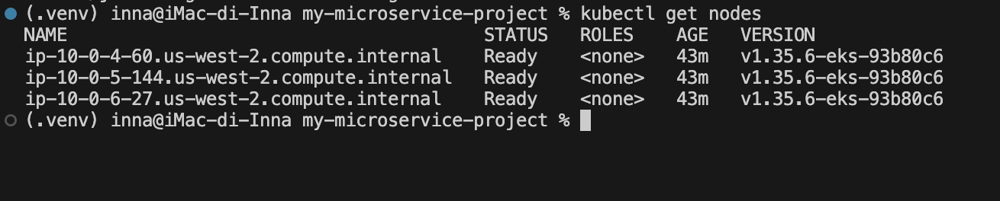
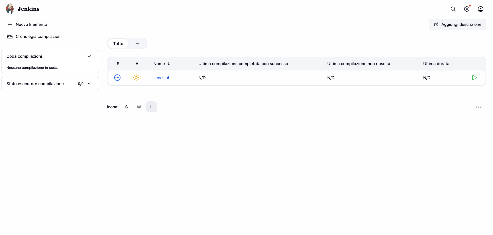
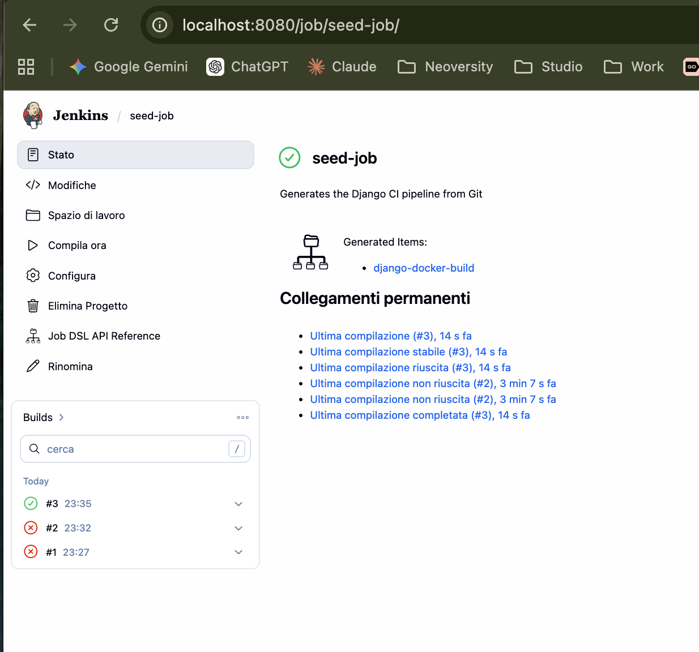
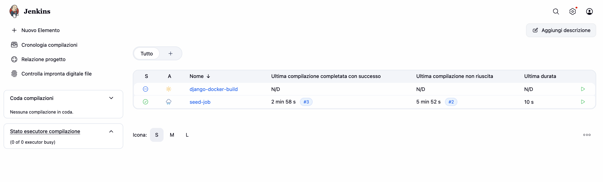
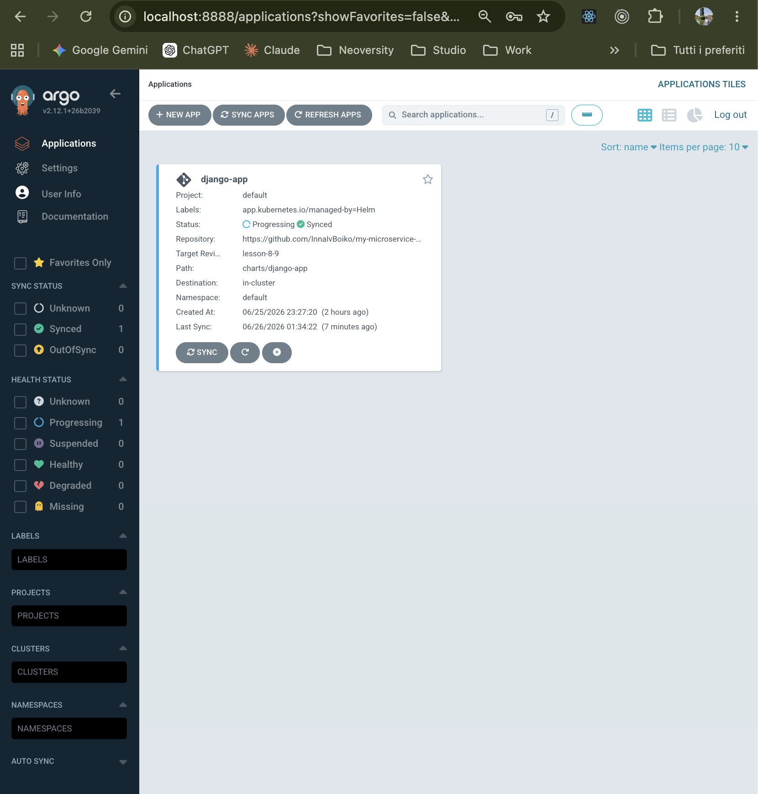
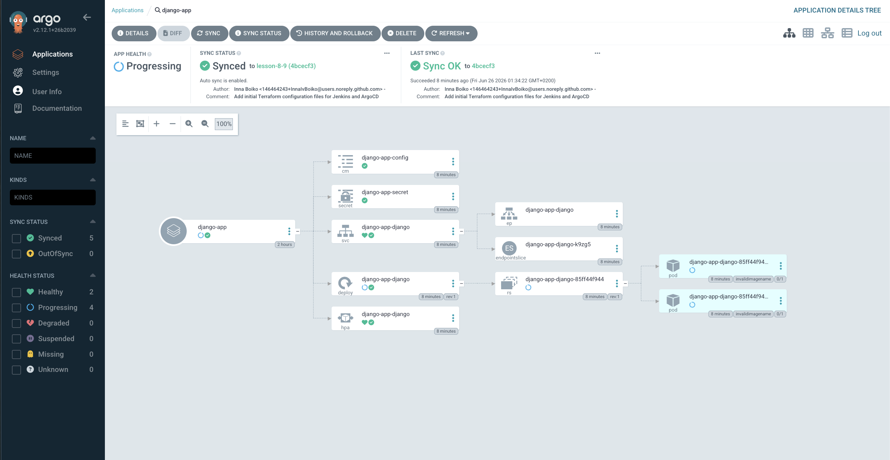

# Lesson 8-9: CI/CD with Jenkins + ArgoCD on AWS EKS

Full CI/CD pipeline on AWS EKS: Jenkins builds and pushes a Docker image to ECR using Kaniko, updates the Helm chart tag in Git, and ArgoCD automatically deploys the new version to Kubernetes.

---

## CI/CD Flow

```
Developer
    │
    │  git push (lesson-8-9)
    ▼
GitHub (my-microservice-project)
    │
    │  webhook / poll SCM
    ▼
Jenkins (running inside EKS)
    │
    ├─► [Stage 1] Build & Push Docker Image
    │       Kaniko reads docker/django/Dockerfile
    │       Pushes image to Amazon ECR
    │       Tags: v1.0.{BUILD_NUMBER}  +  latest
    │
    └─► [Stage 2] Update Helm Chart Tag
            Clones repo, checks out lesson-8-9
            Updates charts/django-app/values.yaml → tag: v1.0.N
            git commit + git push  [skip ci]  → GitHub
                │
                │  ArgoCD detects change (autoSync)
                ▼
            Kubernetes (EKS)
                Rolling update of Django pods
                ✅ New version is live
```

---

## Infrastructure

| Module | Resources |
|---|---|
| **s3-backend** | S3 bucket (versioned, encrypted) + DynamoDB for state locking |
| **vpc** | VPC `10.0.0.0/16`, 3 public + 3 private subnets, IGW, NAT Gateway |
| **ecr** | ECR repository with scan-on-push |
| **eks** | EKS cluster + managed node group (3× `t3.small`) + EBS CSI Driver (IRSA) |
| **jenkins** | Jenkins `5.9.29` via Helm; JCasC auto-creates credentials and seed job; IRSA for Kaniko → ECR |
| **argo_cd** | ArgoCD `7.4.4` via Helm; repo credentials via Kubernetes Secret; Application CRDs via local chart |

---

## Screenshots

### EKS Nodes Ready



### Jenkins — Dashboard with seed-job



### Jenkins — seed-job creates django-docker-build pipeline



### Jenkins — seed-job build details



### ArgoCD — django-app Synced



### ArgoCD — Application Detail Tree



---

## How to Apply Terraform

### Prerequisites

- AWS CLI configured (`aws configure`)
- Terraform ≥ 1.5.0
- kubectl + Helm installed
- GitHub Personal Access Token with **repo** + **workflow** scopes

### Step 1 — Fill in secrets

```bash
cp terraform.tfvars.example terraform.tfvars
# Edit terraform.tfvars with your real values:
#   jenkins_admin_password, github_username, github_token
```

### Step 2 — Bootstrap S3 backend (first time only)

```bash
terraform init -reconfigure
terraform apply -target=module.s3_backend
terraform init -migrate-state    # answer "yes" to migrate state to S3
```

### Step 3 — Deploy VPC, ECR, EKS

```bash
terraform apply -target=module.vpc -target=module.ecr -target=module.eks
```

> EKS cluster creation takes ~15 minutes.

### Step 4 — Connect kubectl

```bash
aws eks update-kubeconfig --region us-west-2 --name lesson-8-9-eks
kubectl get nodes    # wait until all 3 nodes show Ready
```

### Step 5 — Deploy Jenkins + ArgoCD

```bash
# Set bootstrap_mode = false in terraform.tfvars, then:
terraform init -migrate-state
terraform apply
```

---

## How to Check the Jenkins Job

### Access Jenkins UI

```bash
kubectl port-forward svc/jenkins -n jenkins 8080:80
```

Open **http://localhost:8080**
- **Username:** `admin`
- **Password:** value of `jenkins_admin_password` from `terraform.tfvars`

### Run the seed-job

1. On the dashboard click **seed-job** → **Build Now**
2. If it fails with "script not yet approved":
   - Go to **Manage Jenkins** → **In-process Script Approval** → click **Approve**
   - Run **seed-job** again
3. After success the dashboard shows the `django-docker-build` pipeline

### Run the CI pipeline

1. Click **django-docker-build** → **Build Now**
2. Open **Console Output** — you will see:
   - Kaniko building the Docker image from `docker/django/Dockerfile`
   - Image pushed to ECR with tag `v1.0.{BUILD_NUMBER}` and `latest`
   - `charts/django-app/values.yaml` updated with the new tag
   - `git commit` + `git push` with `[skip ci]` to avoid loop

### Verify the image in ECR

```bash
aws ecr describe-images \
  --repository-name lesson-8-9-ecr \
  --region us-west-2 \
  --query 'imageDetails[*].{Tag:imageTags[0],Pushed:imagePushedAt}' \
  --output table
```

---

## How to See the Result in ArgoCD

### Get the admin password

```bash
kubectl -n argocd get secret argocd-initial-admin-secret \
  -o jsonpath='{.data.password}' | base64 -d && echo ""
```

### Access ArgoCD UI

```bash
kubectl port-forward svc/argo-cd-argocd-server -n argocd 8888:80
```

Open **http://localhost:8888**
- **Username:** `admin`
- **Password:** printed by the command above

### What to verify

1. Open **Applications** → select **django-app**
2. **Sync Status** must be **Synced** (green) — ArgoCD pulled the latest Git commit
3. **Health Status** becomes **Healthy** once the Django pods start successfully
4. After Jenkins pushes a new image tag, ArgoCD auto-syncs within ~3 minutes
5. The **History and Rollback** tab shows each sync with the triggering commit

### Verify pods are updated

```bash
kubectl get pods -n default
kubectl describe pod -n default -l app=django \
  | grep Image
# Should show the new ECR tag: v1.0.N
```

---

## Security Notes

- Jenkins admin password stored in a Kubernetes Secret — never in `values.yaml`
- GitHub token injected via Kubernetes Secret + `extraEnvVars` — not plain text in Helm values
- ArgoCD repo credentials stored as a labeled Kubernetes Secret — not in chart values
- Kaniko authenticates to ECR via IRSA — no AWS credentials stored in the cluster
- EBS volumes are encrypted (`gp3`, `encrypted: true`)
- `terraform.tfvars` is gitignored — never commit real secrets

---

## Teardown

```bash
helm uninstall jenkins -n jenkins
helm uninstall argo-cd -n argocd
terraform destroy
```
