# Final Project: DevOps Infrastructure on AWS (EKS + CI/CD + RDS/Aurora)

Full DevOps infrastructure on AWS provisioned with Terraform: VPC, EKS, ECR, Jenkins + ArgoCD (CI/CD), RDS/Aurora, and monitoring (Prometheus + Grafana).

This module provisions either a standard **AWS RDS instance** (PostgreSQL / MySQL) or an **Aurora cluster** from a single set of variables, controlled by the `use_aurora` flag.

---

## RDS Module — What It Does

Set `use_aurora = true` to get an Aurora cluster with one or more instances.  
Set `use_aurora = false` (default) to get a standard RDS instance.

| Flag | Resources Created |
|------|-------------------|
| `use_aurora = false` | `aws_db_instance` + `aws_db_parameter_group` |
| `use_aurora = true` | `aws_rds_cluster` + `aws_rds_cluster_instance` × N + `aws_rds_cluster_parameter_group` |

In both cases the module always creates:
- `aws_db_subnet_group` — places the DB in the correct subnets
- `aws_security_group` — controls inbound access on the DB port (restricted to VPC CIDR)
- A parameter group with custom parameters (`max_connections`, `log_statement`, `work_mem`, …)

---

## Usage Examples

### Standard RDS (PostgreSQL)

```hcl
module "rds" {
  source = "./modules/rds"

  name       = "myapp-db"
  use_aurora = false

  engine                     = "postgres"
  engine_version             = "16.9"
  parameter_group_family_rds = "postgres16"

  instance_class          = "db.t3.micro"     # free-tier eligible
  allocated_storage       = 20
  db_name                 = "myapp"
  username                = "postgres"
  password                = var.db_password    # keep secrets in variables / Secrets Manager
  multi_az                = false
  publicly_accessible     = false
  backup_retention_period = 0                  # 0 = disabled (free-tier); set >= 1 for prod

  vpc_id              = module.vpc.vpc_id
  subnet_private_ids  = module.vpc.private_subnets
  subnet_public_ids   = module.vpc.public_subnets
  ingress_cidr_blocks = ["10.0.0.0/16"]       # restrict to VPC CIDR

  parameters = {
    max_connections = "200"   # max simultaneous connections
    log_statement   = "ddl"  # log CREATE/ALTER/DROP statements
    work_mem        = "65536" # per-sort memory in kB (64 MB)
  }

  tags = {
    Environment = "dev"
    Project     = "myapp"
  }
}
```

### Aurora PostgreSQL Cluster

```hcl
module "rds" {
  source = "./modules/rds"

  name       = "myapp-aurora"
  use_aurora = true

  engine_cluster                = "aurora-postgresql"
  engine_version_cluster        = "15.3"
  parameter_group_family_aurora = "aurora-postgresql15"
  aurora_instance_count         = 2   # 1 writer + 1 reader

  instance_class          = "db.r6g.large"
  db_name                 = "myapp"
  username                = "postgres"
  password                = var.db_password
  publicly_accessible     = false
  backup_retention_period = 7
  deletion_protection     = true      # recommended for production

  vpc_id              = module.vpc.vpc_id
  subnet_private_ids  = module.vpc.private_subnets
  subnet_public_ids   = module.vpc.public_subnets
  ingress_cidr_blocks = ["10.0.0.0/16"]

  parameters = {
    max_connections = "500"
    log_statement   = "ddl"
    work_mem        = "65536"
  }

  tags = {
    Environment = "prod"
    Project     = "myapp"
  }
}
```

### Switching to MySQL

```hcl
module "rds" {
  source = "./modules/rds"

  name       = "myapp-mysql"
  use_aurora = false

  engine                     = "mysql"
  engine_version             = "8.0.36"
  parameter_group_family_rds = "mysql8.0"
  db_port                    = 3306

  instance_class    = "db.t3.micro"
  allocated_storage = 20
  db_name           = "myapp"
  username          = "admin"
  password          = var.db_password

  vpc_id             = module.vpc.vpc_id
  subnet_private_ids = module.vpc.private_subnets
  subnet_public_ids  = module.vpc.public_subnets
}
```

---

## Variable Reference

| Variable | Type | Default | Description |
|----------|------|---------|-------------|
| `name` | `string` | — | Identifier prefix for all resources created by this module |
| `use_aurora` | `bool` | `false` | `true` → Aurora cluster + instances; `false` → standard RDS instance |
| **Standard RDS** | | | |
| `engine` | `string` | `"postgres"` | DB engine: `postgres`, `mysql`, `mariadb`, … |
| `engine_version` | `string` | `"16.9"` | Engine version for standard RDS |
| `parameter_group_family_rds` | `string` | `"postgres16"` | Parameter group family (e.g. `mysql8.0`, `postgres16`) |
| `allocated_storage` | `number` | `20` | Disk size in GiB (standard RDS only; Aurora manages storage automatically) |
| `multi_az` | `bool` | `false` | Enable Multi-AZ standby replica (standard RDS only) |
| **Aurora** | | | |
| `engine_cluster` | `string` | `"aurora-postgresql"` | Aurora engine: `aurora-postgresql` or `aurora-mysql` |
| `engine_version_cluster` | `string` | `"15.3"` | Engine version for the Aurora cluster |
| `parameter_group_family_aurora` | `string` | `"aurora-postgresql15"` | Parameter group family for Aurora |
| `aurora_instance_count` | `number` | `2` | Total Aurora instances (1 writer + N-1 readers) |
| **Common** | | | |
| `instance_class` | `string` | `"db.t3.micro"` | Instance type for the DB node(s) |
| `db_name` | `string` | — | Name of the initial database |
| `username` | `string` | — | Master username |
| `password` | `string` | — | Master password (sensitive) |
| `vpc_id` | `string` | — | VPC where the database is deployed |
| `subnet_private_ids` | `list(string)` | — | Private subnets (used when `publicly_accessible = false`) |
| `subnet_public_ids` | `list(string)` | — | Public subnets (used when `publicly_accessible = true`) |
| `publicly_accessible` | `bool` | `false` | Expose the database endpoint on a public IP |
| `db_port` | `number` | `5432` | Database port (5432 for PostgreSQL, 3306 for MySQL) |
| `ingress_cidr_blocks` | `list(string)` | `["0.0.0.0/0"]` | CIDRs allowed to reach the DB port — restrict to VPC CIDR in production |
| `backup_retention_period` | `number` | `0` | Days to keep automated backups (0 = disabled; Aurora requires >= 1) |
| **Security & maintenance** | | | |
| `storage_encrypted` | `bool` | `true` | Encrypt DB storage at rest with AES-256 |
| `deletion_protection` | `bool` | `false` | Prevent accidental deletion — set `true` in production |
| `copy_tags_to_snapshot` | `bool` | `true` | Copy all resource tags to automated and manual snapshots |
| `auto_minor_version_upgrade` | `bool` | `true` | Apply minor engine upgrades automatically during the maintenance window |
| **Parameters & tags** | | | |
| `parameters` | `map(string)` | `{}` | DB parameter overrides: `{ max_connections = "200", log_statement = "ddl", work_mem = "65536" }` |
| `tags` | `map(string)` | `{}` | Tags applied to every resource in the module |

---

## Outputs

| Output | Description |
|--------|-------------|
| `db_endpoint` | Primary connection endpoint (writer endpoint for Aurora) |
| `db_reader_endpoint` | Read-only endpoint (Aurora only; `null` for standard RDS) |
| `db_port` | Port the database listens on |
| `db_name` | Name of the initial database |
| `security_group_id` | ID of the security group attached to the DB |
| `subnet_group_name` | Name of the DB subnet group |

---

## How to Change Engine, Instance Type, or Switch Modes

**Change the engine** — update `engine` + `engine_version` + `parameter_group_family_rds` together.  
Engine and parameter group family must always match (e.g. `mysql` → `mysql8.0`).

**Change the instance class** — update `instance_class`.  
For Aurora production workloads prefer memory-optimised classes (`db.r6g.*`, `db.r7g.*`).  
For dev/test `db.t3.micro` is sufficient and free-tier eligible.

**Switch between RDS and Aurora** — toggle `use_aurora`.  
This destroys the existing database and creates a new one — migrate data first.

**Add more readers (Aurora only)** — increase `aurora_instance_count`.  
The first instance is always the writer; all subsequent ones become readers.

**Restrict network access** — set `ingress_cidr_blocks` to your VPC CIDR instead of `0.0.0.0/0`.

---

## Screenshots

### 1. Terraform Init

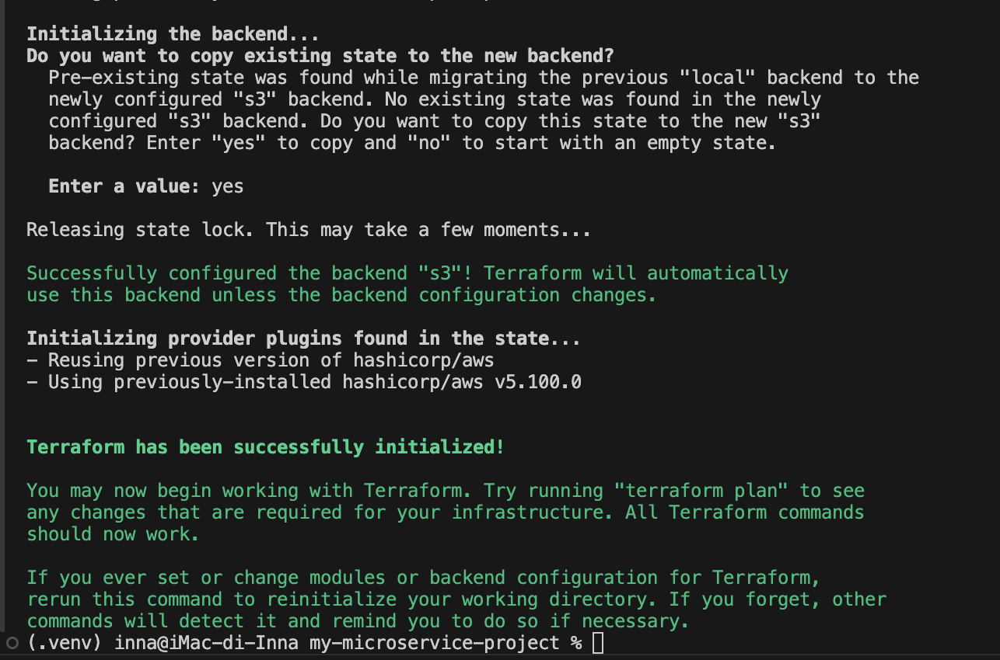

### 2. Terraform Apply — RDS Created

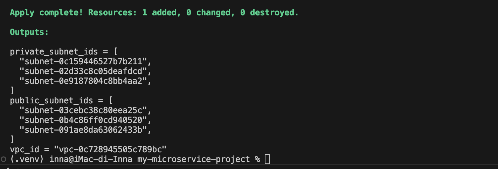

### 3. AWS Console — VPC with Subnets

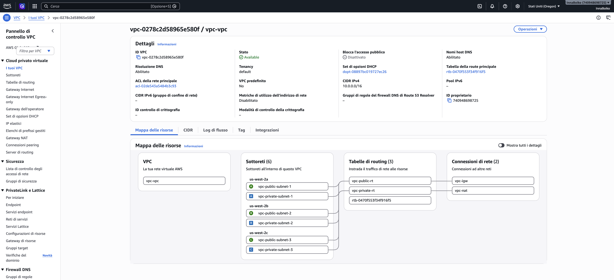

### 4. AWS Console — RDS Instance Available

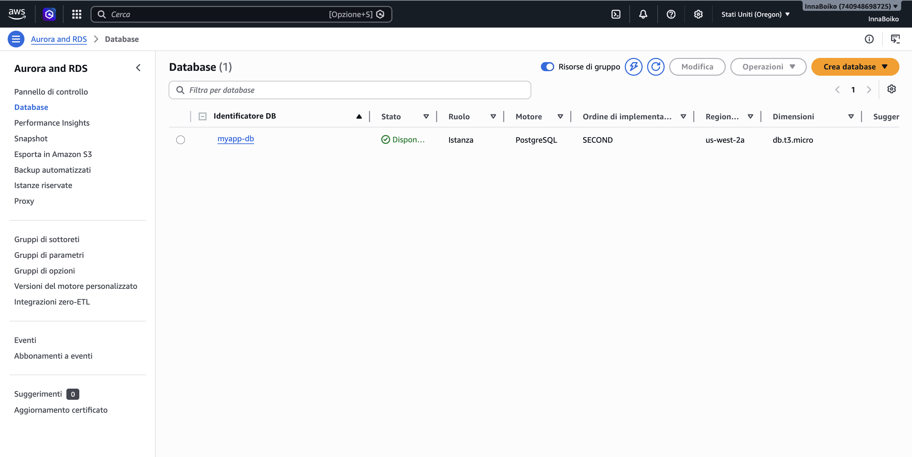

### 5. AWS Console — RDS Connectivity & Endpoint

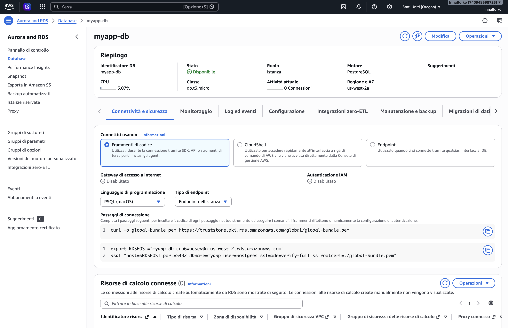

### 6. Aurora Mode — Plan: Destroy Standard RDS

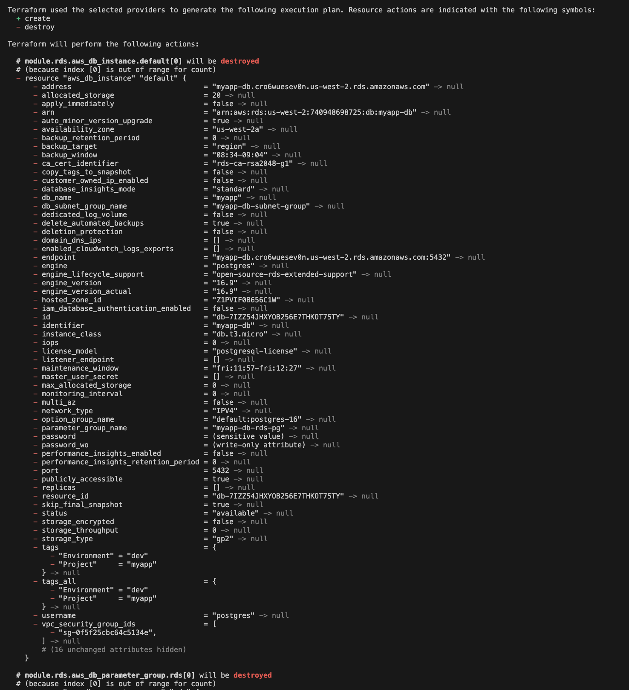

### 7. Aurora Mode — Plan: Create Aurora Cluster

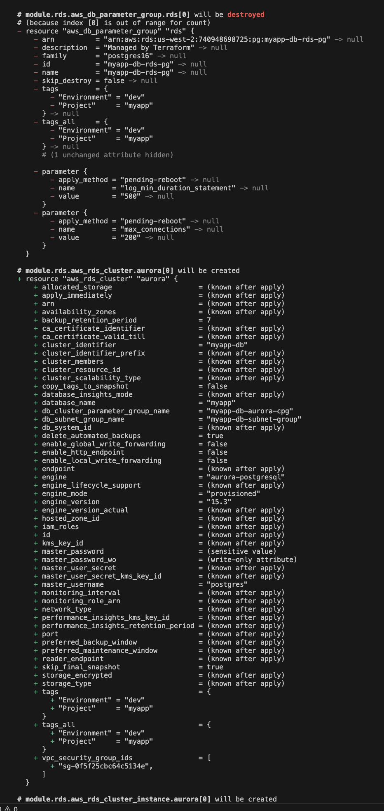

### 8. Aurora Mode — Plan: Create Aurora Instances

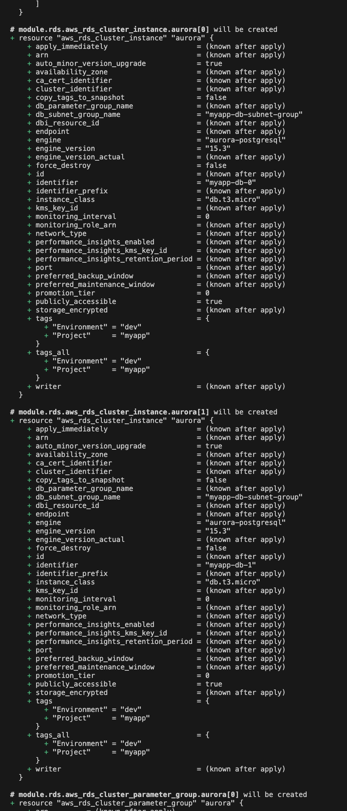

### 9. Aurora Mode — Plan Summary (4 to add, 2 to destroy)

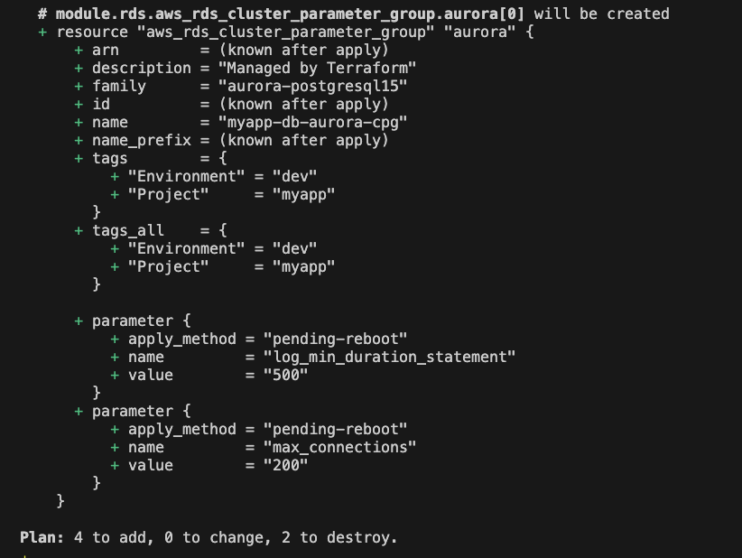

### 10. Terraform Output

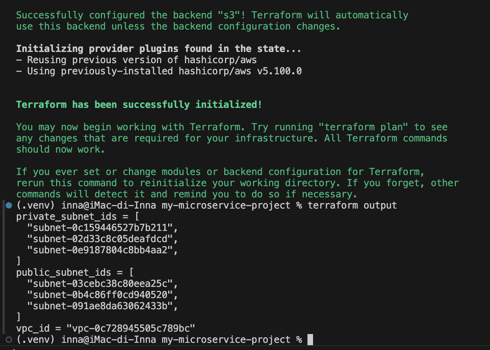

### 11. Terraform Destroy

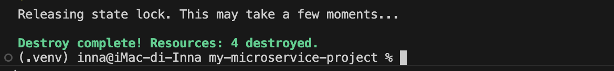

---

## Infrastructure

| Module | Resources |
|--------|-----------|
| **s3-backend** | S3 bucket (versioned, encrypted, lifecycle policy) + DynamoDB for state locking |
| **vpc** | VPC `10.0.0.0/16`, 3 public + 3 private subnets, IGW, NAT Gateway |
| **ecr** | ECR repository with scan-on-push, AES256 encryption, account-scoped policy |
| **eks** | EKS cluster + managed node group (3× `t3.small`) + EBS CSI Driver (IRSA) |
| **jenkins** | Jenkins via Helm; JCasC auto-creates credentials and seed job; IRSA for Kaniko → ECR |
| **argo_cd** | ArgoCD via Helm; repo credentials via Kubernetes Secret; Application CRDs via local chart |
| **rds** | Flexible module — standard RDS or Aurora, with subnet group, security group, parameter group |
| **monitoring** | kube-prometheus-stack via Helm (Prometheus + Grafana + Alertmanager); metrics-server EKS add-on backs the Django HPA |

---

## How to Apply Terraform

### Prerequisites

- AWS CLI configured (`aws configure`)
- Terraform ≥ 1.5.0
- kubectl + Helm installed
- GitHub Personal Access Token with **repo** + **workflow** scopes

### Step 1 — Fill in secrets

```bash
cp example.tfvars terraform.tfvars
# Edit terraform.tfvars with your real values
```

### Step 2 — Bootstrap S3 backend (first time only)

```bash
# Comment out backend.tf, then:
terraform init
terraform apply -target=module.s3_backend
# Uncomment backend.tf, then:
terraform init -migrate-state
```

### Step 3 — Deploy VPC + RDS (module testing)

```bash
# Set bootstrap_mode = true in terraform.tfvars
terraform apply -target=module.vpc -target=module.rds -auto-approve
```

### Step 4 — Deploy full infrastructure

```bash
terraform apply -target=module.vpc -target=module.ecr -target=module.eks
aws eks update-kubeconfig --region us-west-2 --name final-project-eks
kubectl get nodes

# Set bootstrap_mode = false in terraform.tfvars, then:
terraform init -migrate-state
terraform apply
```

---

## CI/CD Flow

```
Developer
    │
    │  git push (final-project)
    ▼
GitHub (my-microservice-project)
    │
    │  webhook / poll SCM
    ▼
Jenkins (running inside EKS)
    │
    ├─► [Stage 1] Build & Push Docker Image
    │       Kaniko reads docker/django/Dockerfile
    │       Pushes image to Amazon ECR
    │
    └─► [Stage 2] Update Helm Chart Tag
            Updates charts/django-app/values.yaml
            git commit + git push [skip ci]
                │
                │  ArgoCD detects change (autoSync)
                ▼
            Kubernetes (EKS)
                Rolling update of Django pods
                ✅ New version is live
```

---

## Monitoring & Autoscaling

Prometheus, Grafana and Alertmanager are deployed via the `kube-prometheus-stack` Helm chart (module `monitoring`). Node/pod metrics come from `node-exporter` and `kube-state-metrics`, both bundled with the chart. The `metrics-server` EKS add-on (module `eks`) exposes the Metrics API that the Django `HorizontalPodAutoscaler` (`charts/django-app/templates/hpa.yaml`) reads CPU utilization from to scale pods automatically.

```bash
# Grafana (default user: admin, password from terraform.tfvars)
kubectl port-forward svc/kube-prometheus-stack-grafana 3000:80 -n monitoring

# Prometheus
kubectl port-forward svc/kube-prometheus-stack-prometheus 9090:9090 -n monitoring
```

Open http://localhost:3000, sign in, and check the built-in "Kubernetes / Compute Resources" dashboards for cluster and pod metrics.

---

## Security Notes

- RDS security group restricts access to VPC CIDR only (`10.0.0.0/16`)
- RDS storage encrypted at rest with AES-256 (`storage_encrypted = true` by default)
- S3 state bucket: AES256 encryption + public access blocked + lifecycle policy
- ECR repository policy scoped to current AWS account only
- `DJANGO_SECRET_KEY` and `POSTGRES_PASSWORD` injected via Kubernetes Secret
- `DEBUG=False` set via Kubernetes ConfigMap in production
- Jenkins admin password stored in Kubernetes Secret — never in `values.yaml`
- Kaniko authenticates to ECR via IRSA — no AWS credentials in the cluster
- `terraform.tfvars` is gitignored — never commit real secrets

---

## Teardown

```bash
# Destroy only RDS (keep VPC for further work):
terraform destroy -target=module.rds -auto-approve

# Destroy everything:
terraform destroy -auto-approve
```

> **Warning:** `terraform destroy` also removes the S3 bucket and DynamoDB table used for state storage.  
> Recreate them first (`terraform apply -target=module.s3_backend`) before the next apply.
