# Final Project: DevOps Infrastructure on AWS

Full DevOps automation stack on AWS, provisioned end-to-end with Terraform: **VPC → EKS → ECR → Jenkins + ArgoCD (CI/CD) → RDS/Aurora → Prometheus/Grafana (monitoring + autoscaling)**.

A Django application is built by Jenkins (Kaniko, no Docker-in-Docker), pushed to ECR, and deployed to Kubernetes by ArgoCD via GitOps — every `git push` to `final-project` results in a rolling update, with no manual `kubectl apply` involved.

---

## Project Evolution

This repository was built incrementally across the course, one lesson at a time, and this branch (`final-project`) brings every piece together into one deployable stack:

| Branch | What it added |
|---|---|
| `lesson-3` | Bash script to bootstrap a dev machine (Docker, Docker Compose, Python, Django) |
| `lesson-4` | Dockerized Django + PostgreSQL + Nginx with `docker-compose` |
| `lesson-5` | First Terraform modules: S3+DynamoDB remote state backend, VPC, ECR |
| `lesson-6` | EKS module (control plane + managed node group) |
| `lesson-7` | Django deployed to EKS via a Helm chart (`charts/django-app`) |
| `lesson-8-9` | Jenkins + ArgoCD on EKS — full CI/CD: Kaniko build → ECR push → GitOps sync |
| `lesson-db-module` | Flexible RDS module (standard RDS *or* Aurora from the same variables) |
| **`final-project`** | Adds the **monitoring module** (Prometheus/Grafana/Alertmanager + metrics-server), wires RDS into the Django app, and fixes the whole stack to run together end-to-end |

---

## Project Structure

```
my-microservice-project/
├── main.tf                  # Wires every module together, providers, common tags
├── backend.tf                # Remote state backend (S3 + native lockfile)
├── outputs.tf                 # Aggregated outputs from all modules
├── variables.tf                # Root input variables
├── example.tfvars               # Template — copy to terraform.tfvars
├── Jenkinsfile                   # Kaniko build + ECR push + Helm tag update
│
├── modules/
│   ├── s3-backend/           # S3 bucket + DynamoDB for Terraform state
│   ├── vpc/                  # VPC, public/private subnets, IGW, NAT Gateway
│   ├── ecr/                  # ECR repository (scan-on-push, lifecycle policy)
│   ├── eks/                  # EKS cluster + node group + EBS CSI + metrics-server add-ons
│   ├── rds/                  # Flexible module: standard RDS or Aurora
│   ├── jenkins/               # Jenkins via Helm; JCasC seed job + credentials; IRSA for Kaniko
│   ├── argo_cd/               # ArgoCD via Helm; repo Secret; Application CRDs via local chart
│   └── monitoring/             # kube-prometheus-stack via Helm (Prometheus/Grafana/Alertmanager)
│
├── charts/django-app/          # Helm chart for the Django application
│   └── templates/
│       ├── deployment.yaml     # Pod spec, probes, resources
│       ├── service.yaml        # LoadBalancer
│       ├── configmap.yaml      # Non-sensitive env vars
│       ├── secret.yaml         # DB password, Django secret key
│       └── hpa.yaml            # Autoscaler: 1–6 pods at >70% CPU
│
├── docker/django/             # Django application source + Dockerfile
│
└── public/
    ├── images/                # Screenshots (see below)
    └── jenkins-console-output-build-4.txt   # Full log of a successful CI/CD run
```

---

## Infrastructure Modules

| Module | Resources |
|--------|-----------|
| **s3-backend** | S3 bucket (versioned, AES-256 encrypted, public access blocked, 90-day lifecycle policy) + DynamoDB for state locking |
| **vpc** | VPC `10.0.0.0/16`, 3 public + 3 private subnets across 3 AZs, IGW, NAT Gateway |
| **ecr** | ECR repository, scan-on-push, AES-256 encryption, account-scoped access policy |
| **eks** | EKS cluster + managed node group (`t3.small`, autoscaled 1–6) + EBS CSI Driver (IRSA) + metrics-server add-on |
| **jenkins** | Jenkins via Helm; JCasC auto-creates the `github-token` credential and a seed job; IRSA lets Kaniko push to ECR without static AWS credentials |
| **argo_cd** | ArgoCD via Helm; repo credentials via a labeled Kubernetes Secret; the Django `Application` CRD is created from a local Helm chart (`modules/argo_cd/charts`) |
| **rds** | Flexible module — `use_aurora = true/false` switches between a standard RDS instance and an Aurora cluster, from the same variables |
| **monitoring** | `kube-prometheus-stack` via Helm — Prometheus, Grafana, Alertmanager, node-exporter, kube-state-metrics — backs the Grafana dashboards and, together with metrics-server, the Django HPA |

---

## RDS Module — Standard RDS or Aurora

Set `use_aurora = true` for an Aurora cluster with one or more instances, or leave it `false` (default) for a standard RDS instance — both from the same variable set.

| Flag | Resources Created |
|------|-------------------|
| `use_aurora = false` | `aws_db_instance` + `aws_db_parameter_group` |
| `use_aurora = true` | `aws_rds_cluster` + `aws_rds_cluster_instance` × N + `aws_rds_cluster_parameter_group` |

Both modes always create an `aws_db_subnet_group`, an `aws_security_group` restricted to the VPC CIDR, and a parameter group with custom parameters (`max_connections`, `log_statement`, `work_mem`, …). See [Variable Reference](#variable-reference) below for the full list.

### Usage example (current `main.tf` configuration)

```hcl
module "rds" {
  source = "./modules/rds"

  name                       = "myapp-db"
  use_aurora                 = false
  engine                     = "postgres"
  engine_version             = "16.9"
  parameter_group_family_rds = "postgres16"

  instance_class          = "db.t3.micro"    # free-tier eligible
  allocated_storage       = 20
  db_name                 = "myapp"
  username                = "postgres"
  password                = "..."             # keep real secrets out of git
  subnet_private_ids      = module.vpc.private_subnets
  subnet_public_ids       = module.vpc.public_subnets
  publicly_accessible     = true
  vpc_id                  = module.vpc.vpc_id
  ingress_cidr_blocks     = ["10.0.0.0/16"]   # restrict to VPC CIDR, never 0.0.0.0/0
  multi_az                = false             # free-tier: single-AZ only
  backup_retention_period = 0                 # free-tier: automated backups disabled

  parameters = {
    max_connections = "200"
    log_statement   = "ddl"
    work_mem        = "65536"
  }
}
```

### Variable Reference

| Variable | Type | Default | Description |
|----------|------|---------|-------------|
| `name` | `string` | — | Identifier prefix for all resources created by this module |
| `use_aurora` | `bool` | `false` | `true` → Aurora cluster + instances; `false` → standard RDS instance |
| `engine` / `engine_version` / `parameter_group_family_rds` | | `postgres` / `16.9` / `postgres16` | Standard RDS engine settings |
| `engine_cluster` / `engine_version_cluster` / `parameter_group_family_aurora` | | `aurora-postgresql` / `15.3` / `aurora-postgresql15` | Aurora engine settings |
| `aurora_instance_count` | `number` | `2` | Total Aurora instances (1 writer + N-1 readers) |
| `instance_class` | `string` | `db.t3.micro` | Instance type for the DB node(s) |
| `vpc_id` / `subnet_private_ids` / `subnet_public_ids` | | — | Networking placement |
| `publicly_accessible` | `bool` | `false` | Expose the DB endpoint on a public IP |
| `ingress_cidr_blocks` | `list(string)` | `["0.0.0.0/0"]` | CIDRs allowed to reach the DB port — restrict to VPC CIDR in production |
| `backup_retention_period` | `number` | `0` | Days of automated backups (Aurora requires ≥ 1) |
| `storage_encrypted` | `bool` | `true` | Encrypt DB storage at rest (AES-256) |
| `deletion_protection` | `bool` | `false` | Set `true` in production |
| `parameters` | `map(string)` | `{}` | DB parameter overrides |
| `tags` | `map(string)` | `{}` | Tags applied to every resource in the module |

### Outputs

| Output | Description |
|--------|-------------|
| `db_endpoint` | Primary connection endpoint (writer endpoint for Aurora) |
| `db_reader_endpoint` | Read-only endpoint (Aurora only) |
| `db_port` / `db_name` | Connection details |
| `security_group_id` / `subnet_group_name` | Networking resources |

Also exposed at the root level as `terraform output rds_endpoint`.

---

## How to Apply Terraform

### Prerequisites

- AWS CLI configured (`aws configure`)
- Terraform ≥ 1.5.0
- kubectl + Helm installed
- GitHub Personal Access Token with **repo** + **workflow** scopes

### Step 1 — Fill in secrets

```bash
cp example.tfvars terraform.tfvars
# Edit terraform.tfvars: jenkins_admin_password, github_username, github_token,
# grafana_admin_password
```

### Step 2 — Bootstrap the S3 backend (first time only)

```bash
# Comment out the backend "s3" block in backend.tf, then:
terraform init
terraform apply -target=module.s3_backend
# Uncomment backend.tf, then:
terraform init -migrate-state
```

### Step 3 — Deploy VPC + ECR + EKS

```bash
# Set bootstrap_mode = true in terraform.tfvars
terraform apply -target=module.vpc -target=module.ecr -target=module.eks
aws eks update-kubeconfig --region us-west-2 --name final-project-eks
kubectl get nodes
```

### Step 4 — Deploy the rest of the stack (Jenkins, ArgoCD, RDS, monitoring)

```bash
# Set bootstrap_mode = false in terraform.tfvars, then:
terraform init -migrate-state
terraform apply
```

### Step 5 — Verify and access the services

```bash
kubectl get all -n jenkins
kubectl get all -n argocd
kubectl get all -n monitoring

kubectl port-forward svc/jenkins 8080:80 -n jenkins
kubectl port-forward svc/argo-cd-argocd-server 8081:443 -n argocd
kubectl port-forward svc/kube-prometheus-stack-grafana 3000:80 -n monitoring
```

> **Note:** the actual Service names depend on the Helm release name set in `main.tf` (`argo_cd` release → `argo-cd-argocd-server`; `monitoring` release → `kube-prometheus-stack-grafana`) and each chart's own port — `jenkins` listens on port **80**, not 8080. Run `kubectl get svc -n <namespace>` if you rename a release and these no longer match.

- **Jenkins** → http://localhost:8080 (credentials from `terraform.tfvars`)
- **ArgoCD** → https://localhost:8081 (user `admin`; password: `kubectl -n argocd get secret argocd-initial-admin-secret -o jsonpath='{.data.password}' | base64 -d`)
- **Grafana** → http://localhost:3000 (user `admin`, password from `terraform.tfvars`)

---

## CI/CD Flow

```
Developer
    │
    │  git push (final-project)
    ▼
GitHub (my-microservice-project)
    │
    │  webhook / poll SCM
    ▼
Jenkins (running inside EKS)
    │
    ├─► [Stage 1] Build & Push Docker Image
    │       Kaniko reads docker/django/Dockerfile
    │       Pushes image to Amazon ECR (tags: v1.0.<BUILD_NUMBER> + latest)
    │
    └─► [Stage 2] Update Helm Chart Tag
            Clones repo, checks out final-project
            Updates charts/django-app/values.yaml → tag: v1.0.N
            git commit + git push  [skip ci]  → GitHub
                │
                │  ArgoCD detects the new commit (autoSync)
                ▼
            Kubernetes (EKS)
                Rolling update of Django pods
                ✅ New version is live
```

The full console log of a successful run is in [public/jenkins-console-output-build-4.txt](public/jenkins-console-output-build-4.txt).

---

## Monitoring & Autoscaling

Prometheus, Grafana and Alertmanager are deployed via the `kube-prometheus-stack` Helm chart (module `monitoring`). Node/pod metrics come from `node-exporter` and `kube-state-metrics`, both bundled with the chart. The `metrics-server` EKS add-on (module `eks`) exposes the Metrics API that the Django `HorizontalPodAutoscaler` ([hpa.yaml](charts/django-app/templates/hpa.yaml)) reads CPU utilization from to scale pods automatically (1–6 replicas at 70% CPU).

```bash
kubectl port-forward svc/kube-prometheus-stack-grafana 3000:80 -n monitoring
kubectl port-forward svc/kube-prometheus-stack-prometheus 9090:9090 -n monitoring
kubectl get hpa -n default
```

Open http://localhost:3000 and check the built-in "Kubernetes / Compute Resources" dashboards for live cluster and pod metrics.

---

## Security Notes

- RDS security group restricts access to the VPC CIDR only (`10.0.0.0/16`)
- RDS storage encrypted at rest with AES-256 (`storage_encrypted = true` by default)
- S3 state bucket: AES-256 encryption + public access blocked + lifecycle policy
- ECR repository policy scoped to the current AWS account only
- IAM roles for Kaniko and the EBS CSI driver use **IRSA** (IAM Roles for Service Accounts) — no static AWS credentials stored in the cluster
- `DJANGO_SECRET_KEY` and `POSTGRES_PASSWORD` are created by Terraform as a `django-app-secret` Kubernetes Secret (`kubernetes_secret_v1.django_app_secret` in `main.tf`) and referenced by the chart via `secret.existingSecret` — `charts/django-app/values.yaml` never holds real credentials, even though it's committed to Git and deployed straight by ArgoCD
- The RDS master password (`var.db_password`) is sourced from `terraform.tfvars` (gitignored), not hardcoded in `main.tf`
- Jenkins admin password and the GitHub token are stored in Kubernetes Secrets — never in `values.yaml` or `Jenkinsfile`
- `terraform.tfvars` is gitignored — never commit real secrets

---

## Troubleshooting Log

Issues actually hit and fixed while bringing this stack up end-to-end — kept here because the fixes aren't obvious from the code alone:

1. **EKS node group stuck in `CREATE_FAILED`** — the AWS account was restricted to Free-Tier-eligible instance launches only; `t3.medium` was rejected (`InvalidParameterCombination - not eligible for Free Tier`) while `t3.small` (already running before) was still accepted. Fix: keep `instance_type = "t3.small"` and scale out via node **count** instead of size — `desired_size`/`max_size` in `main.tf`, plus `aws eks update-nodegroup-config` for `desired_size` (which Terraform intentionally ignores via `lifecycle.ignore_changes`, see [modules/eks/node.tf](modules/eks/node.tf)).
2. **Pods stuck `Pending` — "Too many pods" / "Insufficient memory"** — `t3.small` allows only ~11 pods per node (ENI IP limit); Jenkins + ArgoCD + the full monitoring stack + Django together didn't fit on 3 nodes. Fix: scaled the node group out to 5.
3. **Jenkins `github-token` credential created with an empty password** — Kubernetes injects Secret data into a pod's environment only at container start; the Jenkins pod had booted before `terraform.tfvars` held real GitHub credentials, so JCasC baked in an empty value and never re-read the updated Secret. Fix: `kubectl delete pod jenkins-0 -n jenkins` to force a re-read, then set the credential's password directly via the Jenkins UI when JCasC still didn't pick up the refreshed value on a later boot.
4. **Job DSL seed job failed with "script not yet approved for use"** — Jenkins' script security sandbox blocks inline Job DSL scripts by default. Fix: **Manage Jenkins → Configure Global Security → uncheck "Enable script security for Job DSL scripts"**.
5. **Django pods crash-looping with HTTP 400 on every request** — `DEBUG=False` + a kubelet liveness/readiness probe that hits the pod via its **IP address** as the `Host` header, which wasn't in `ALLOWED_HOSTS`. Fix: set `ALLOWED_HOSTS: "*"` in [charts/django-app/values.yaml](charts/django-app/values.yaml) (acceptable for this demo; a production setup would list the actual probe/ingress hosts).
6. **`charts/django-app/values.yaml` had an empty `image.repository`** — left blank intentionally in an earlier lesson to be passed via `helm install --set`, but ArgoCD deploys the chart straight from Git with no `--set` overrides. Fix: hardcode the real ECR URL in `values.yaml` (not sensitive — it's just an account ID + region + repo name).

---

## Teardown

```bash
# Destroy only RDS (keep the rest of the stack):
terraform destroy -target=module.rds -auto-approve

# Destroy everything:
terraform destroy -auto-approve
```

> **Warning:** `terraform destroy` also removes the S3 bucket and DynamoDB table used for state storage.
> Recreate them first (`terraform apply -target=module.s3_backend`) before the next `terraform apply`.

---

## Screenshots

### 1. Terraform Init


### 2. Terraform Apply
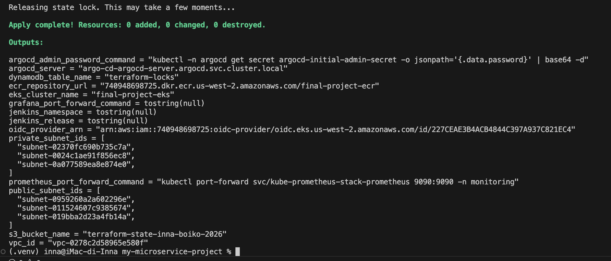

### 3. AWS Console — VPC with Subnets


### 4. `kubectl get nodes` — EKS Nodes Ready
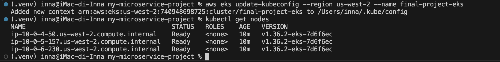

### 5. AWS Console — EKS Cluster Active
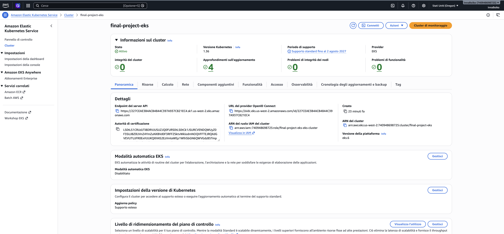

### 6. AWS Console — RDS Instance Available
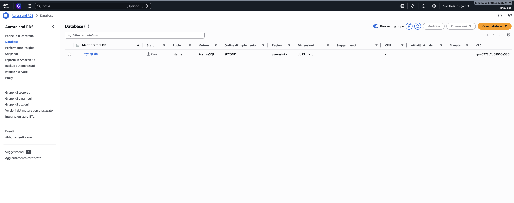

### 7. AWS Console — RDS Connectivity & Endpoint
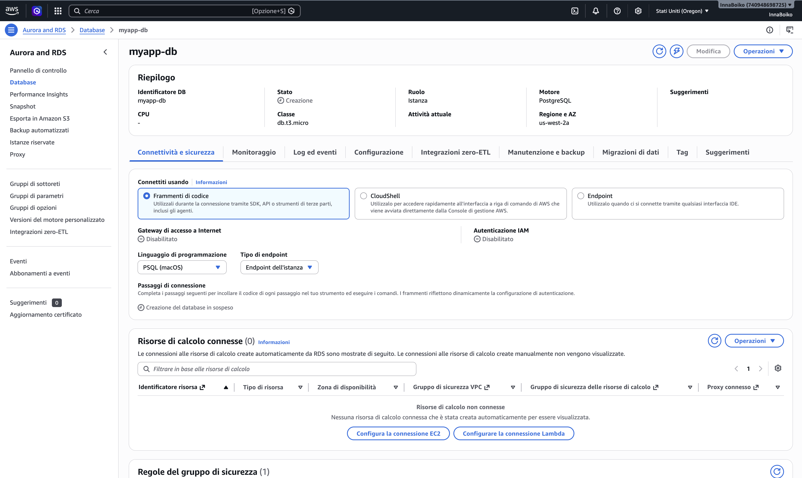

### 8. AWS Console — RDS Security Group (VPC-restricted)
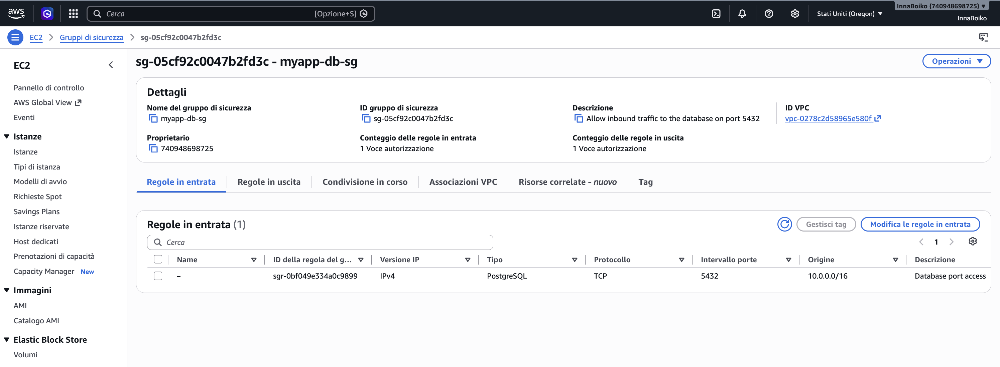

### 9. Terraform State Migrated to S3
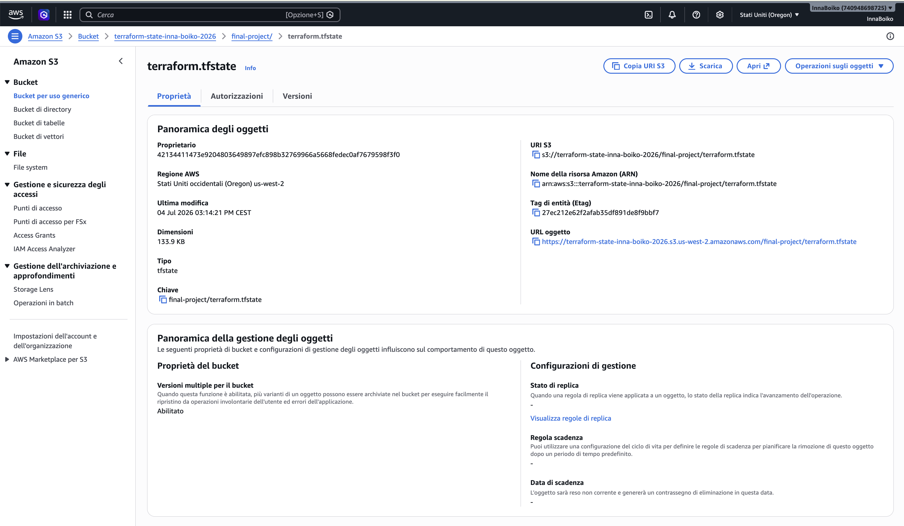

### 10. AWS Console — ECR Repository
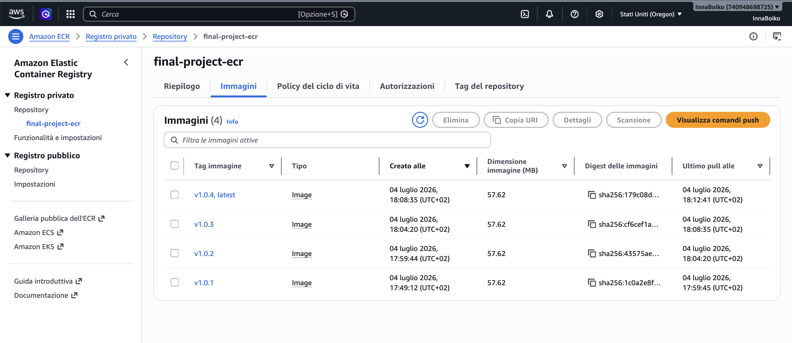

### 11. AWS Console — IAM Roles (IRSA)
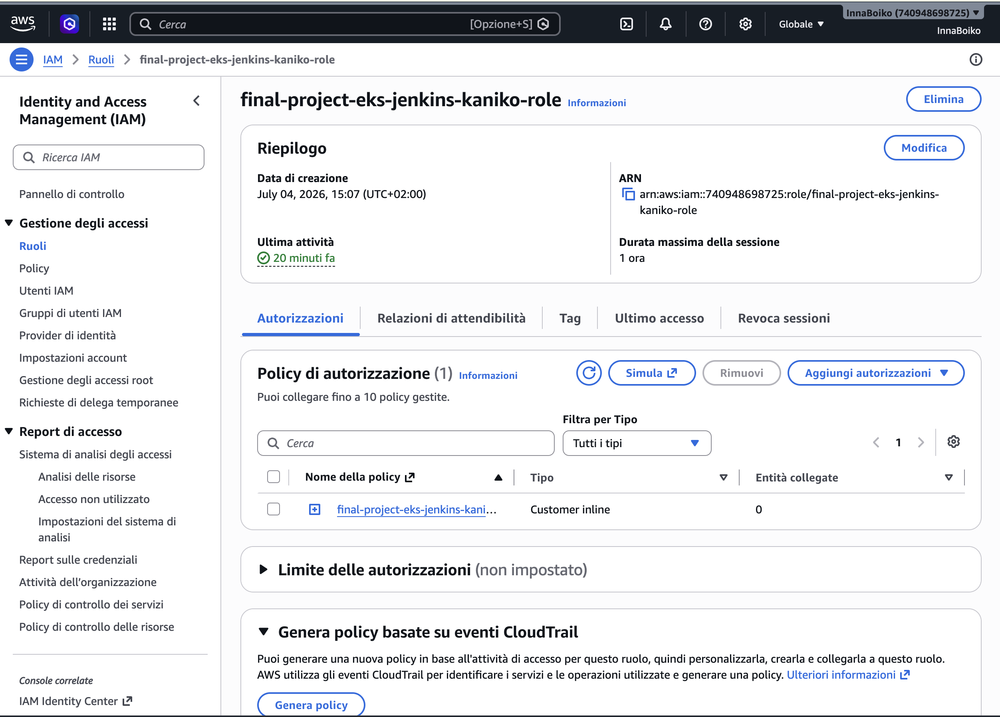

### 12. Jenkins & ArgoCD Resources Running (`kubectl get all`)
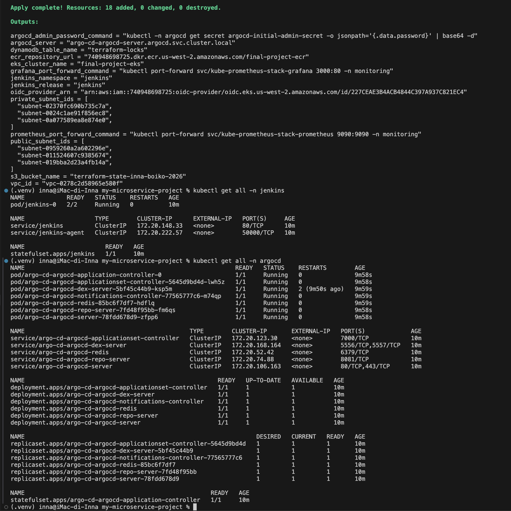

### 13. `kubectl get hpa` — Autoscaler Configured
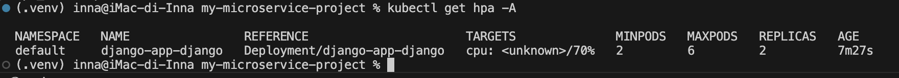

### 14. Jenkins — Build Jobs (`seed-job` + `django-docker-build`)
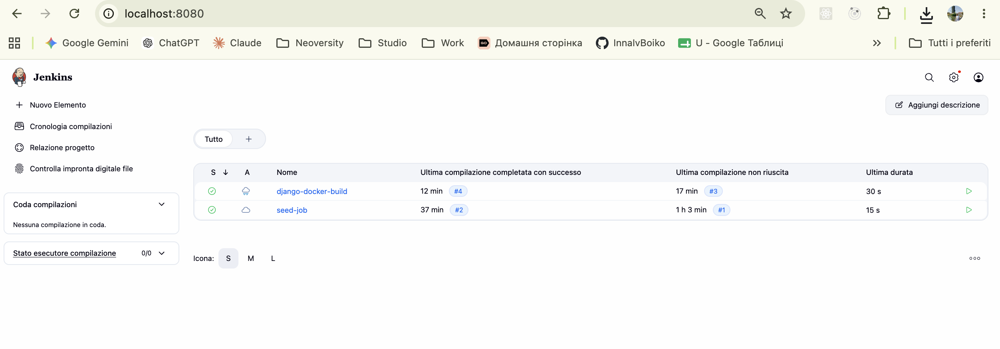

### 15. Jenkins — Console Output of a Successful Build
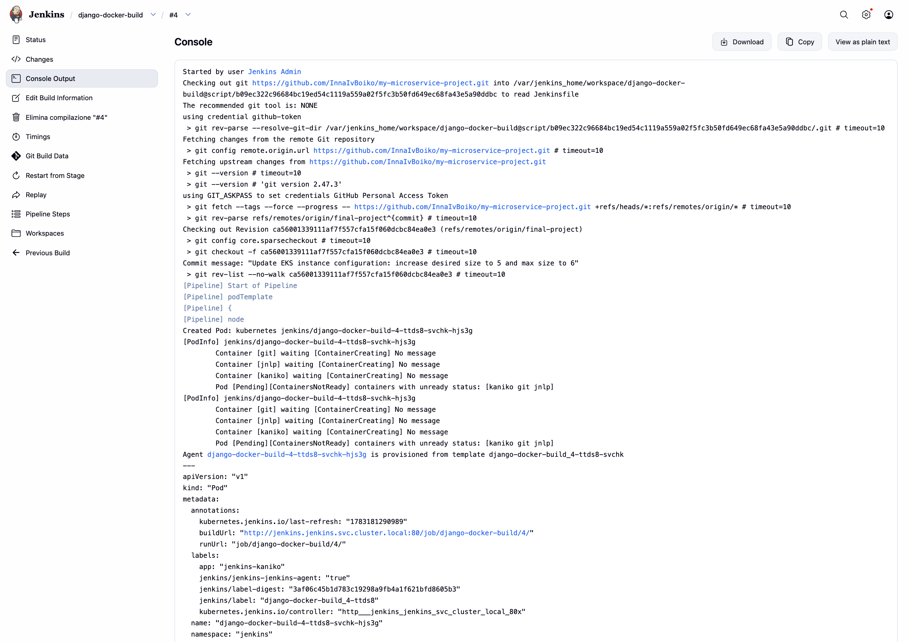

### 16. ArgoCD — `django-app` Synced & Healthy
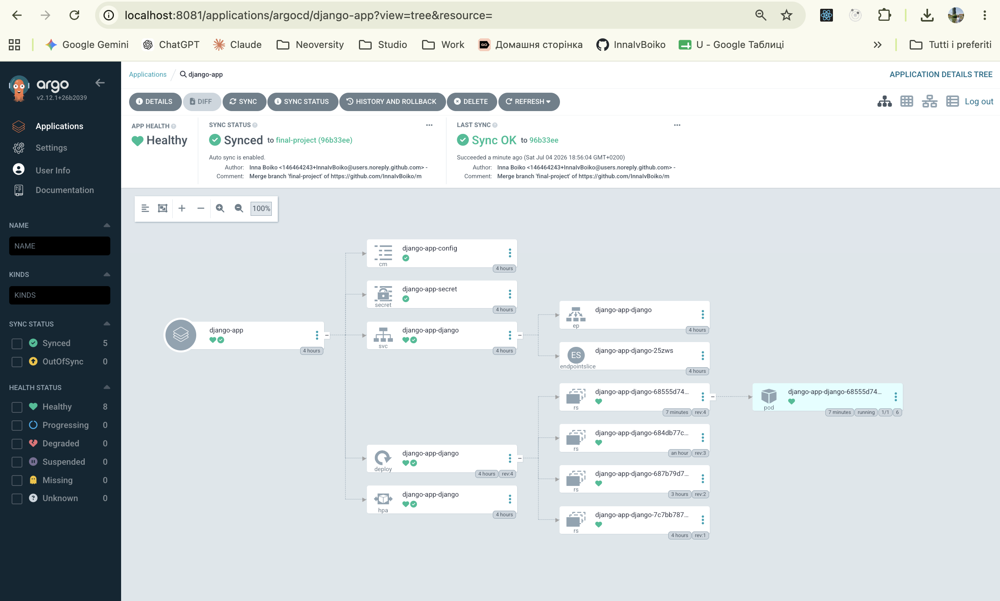

### 17. Django Rollout — Pod Running After CI/CD
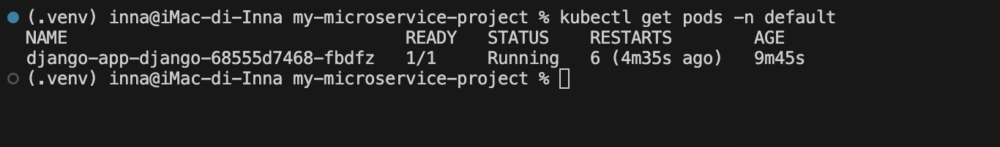

### 18. Grafana — Kubernetes Compute Resources Dashboard
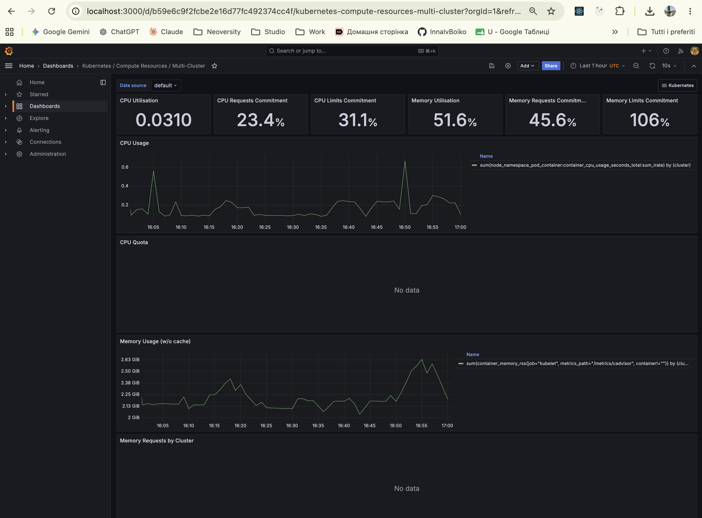

### 19. HPA Connected to Metrics Server
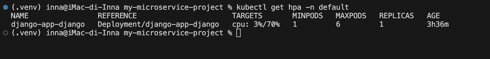

### 20. Terraform Destroy

